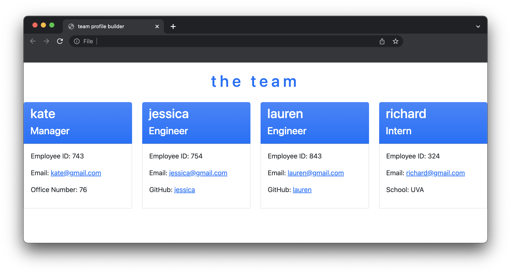

# Columbia University Coding Bootcamp - Team Profile Generator: Challenge 10 

## Description

This command-line applications prompts the user for input on the profile information of team members and then generates an HTML file to display the team roster

https://user-images.githubusercontent.com/96092615/174637057-caef3bc2-4f52-4b7a-a541-50c698f5d43b.mov




## Table of Contents 

* [Installation](#installation)
* [Usage](#usage)
* [Credits](#credits)
* [Tests](#tests)
* [License](#license)


## Installation

To install this project, navigate to your comand line console (for simplicity we will assume you are using terminal) and:

Clone this repository.
```md
git clone git@github.com:katebonner/team-profile-generator.git
```
ensure you have installed node.js by checking the version.
```md
node -v
```
if it has not been installed please navigate to https://nodejs.org/en/download/. lastly, ensure you have installed the node pkg inquirer.js version 8.2.4 or higher.
```md
npm inquierer -v
```
if it has not been installed, install it.
```md
npm install inquirer
```


## Usage

This project provides an example of of how to collect user input via inquirer.js, structure that input into objects, and subsequently re-structure those objects into dynamically generated HTML. 

## Credits

This project leverages [Bootstrap](https://getbootstrap.com/) for styling.

## Tests

https://user-images.githubusercontent.com/96092615/174636984-ffb3665a-f3ff-45b8-9ff2-3ced990f3777.mov


## License

MIT License

Copyright (c) 2022 Kate Bonner

Permission is hereby granted, free of charge, to any person obtaining a copy
of this software and associated documentation files (the "Software"), to deal
in the Software without restriction, including without limitation the rights
to use, copy, modify, merge, publish, distribute, sublicense, and/or sell
copies of the Software, and to permit persons to whom the Software is
furnished to do so, subject to the following conditions:

The above copyright notice and this permission notice shall be included in all
copies or substantial portions of the Software.

THE SOFTWARE IS PROVIDED "AS IS", WITHOUT WARRANTY OF ANY KIND, EXPRESS OR
IMPLIED, INCLUDING BUT NOT LIMITED TO THE WARRANTIES OF MERCHANTABILITY,
FITNESS FOR A PARTICULAR PURPOSE AND NONINFRINGEMENT. IN NO EVENT SHALL THE
AUTHORS OR COPYRIGHT HOLDERS BE LIABLE FOR ANY CLAIM, DAMAGES OR OTHER
LIABILITY, WHETHER IN AN ACTION OF CONTRACT, TORT OR OTHERWISE, ARISING FROM,
OUT OF OR IN CONNECTION WITH THE SOFTWARE OR THE USE OR OTHER DEALINGS IN THE
SOFTWARE.
